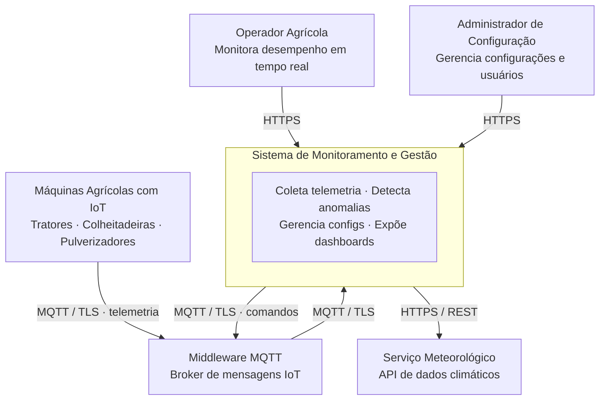

# 🌍 Nível 1 — Diagrama de Contexto

**"Quem usa o sistema e com quem ele conversa?"**

[← README](../README.md) · **C1: Contexto** · [C2: Containers →](./c2-containers.md)

---

## 🎯 O que este nível mostra

O Diagrama de Contexto é o ponto de partida. Aqui o sistema é tratado como uma **caixa preta** — não importa como ele funciona por dentro, apenas **quem interage com ele** e **quais sistemas externos ele depende**.

É o mapa de alto nível que qualquer stakeholder — técnico ou não — consegue entender. Ele responde três perguntas fundamentais:

- 👤 **Quem são os usuários?** Quais personas interagem com o sistema e com qual intenção?
- 🔗 **Quais sistemas externos existem?** Com o que o sistema se integra para funcionar?
- 📡 **Como eles se comunicam?** Quais protocolos e direções de fluxo?

---

## 📊 Diagrama

---

## 🧭 Leitura do Diagrama

| Elemento | Tipo | Papel |
|---|---|---|
| 👨‍🌾 **Operador Agrícola** | Pessoa — usuário primário | Consome informação. Visualiza dashboards, recebe alertas, acompanha métricas de campo em tempo real |
| 🔧 **Administrador de Configuração** | Pessoa — usuário técnico | Produz configuração. Versiona e aplica perfis de comportamento nas máquinas |
| 📦 **Sistema de Monitoramento e Gestão** | **Nosso sistema** | A caixa preta central — tudo o que está dentro dele é detalhado nos níveis seguintes |
| 🚜 **Máquinas Agrícolas com IoT** | Sistema externo | Hardware físico que gera dados. Envia telemetria e obedece comandos remotos |
| 📡 **Middleware MQTT** | Sistema externo | Broker de mensageria entre o campo e a nuvem. Desacopla o protocolo IoT do backend |
| 🌦️ **Serviço Meteorológico** | Sistema externo | API de terceiros somente leitura. Contextualiza anomalias com dados climáticos |

---

## ⚙️ Decisões de Fronteira

### O que está DENTRO do sistema

> Portal web, serviços de ingestão e análise de telemetria, bancos de dados, motor de alertas e módulo de gerenciamento remoto de configurações.

### O que está FORA do sistema

> As máquinas físicas e seu hardware, o broker MQTT (que pode ser local no campo ou gerenciado na nuvem), e a API meteorológica de terceiros.

---

### Por que o Middleware é externo?

O broker MQTT opera como uma camada independente entre o hardware e o backend. Mantê-lo externo deixa explícito que ele **pode ser trocado** (Mosquitto local, AWS IoT Core, HiveMQ) sem impactar o core da plataforma — e reflete a realidade de campo, onde o broker frequentemente roda localmente para tolerar quedas de conectividade.

---

[← README](../README.md) · **C1: Contexto** · [C2: Containers →](./c2-containers.md)

