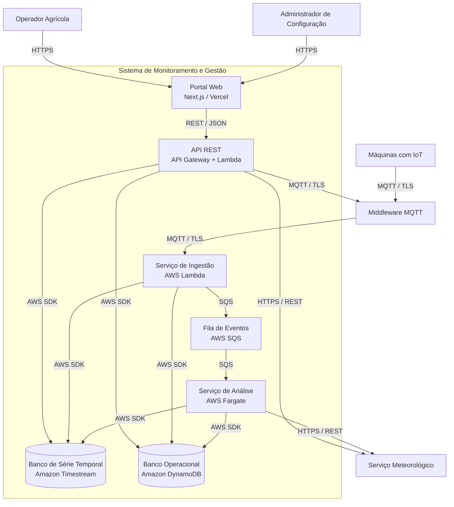

# 📦 Nível 2 — Diagrama de Containers

**"Como o sistema é dividido e quais tecnologias ele usa?"**

[← C1: Contexto](./c1-context.md) · **C2: Containers** · [C3: Componentes →](./c3-components.md)

---

## 🎯 O que este nível mostra

Abrimos a caixa preta do C1. Agora vemos as **partes executáveis** que compõem o sistema — cada container é uma unidade que roda de forma independente: uma aplicação web, um serviço de backend, um banco de dados, uma fila de mensagens.

O C2 responde:

- 🏗️ **Quais são as grandes peças?** Quais serviços/apps/bancos existem?
- 🔧 **Quais tecnologias foram escolhidas?** E por quê cada uma?
- 🔁 **Como eles se comunicam entre si?** E com o mundo externo?

---

## 📊 Diagrama

---

## 🧭 Catálogo de Containers

| Container | Tecnologia | Responsabilidade principal |
|---|---|---|
| 🖥️ **Portal Web** | Next.js / Vercel | Única interface visual do sistema. SSR para performance e SEO |
| 🔌 **API REST** | API Gateway + Lambda | Gateway único para o frontend. Autenticação, roteamento, validação |
| 📥 **Serviço de Ingestão** | AWS Lambda | Consome telemetria do broker e persiste dados — event-driven, sem estado |
| 🧠 **Serviço de Análise** | AWS Fargate | Detecta anomalias com baseline histórico — stateful, longa execução |
| 📬 **Fila de Eventos** | AWS SQS | Buffer assíncrono entre ingestão e análise |
| 📈 **Banco de Série Temporal** | Amazon Timestream | Telemetria histórica com TTL automático e queries otimizadas por tempo |
| 🗃️ **Banco Operacional** | Amazon DynamoDB | Entidades de negócio: máquinas, usuários, configs, alertas |

---

## ⚙️ Decisões de Design

| Decisão | Justificativa |
|---|---|
| **Lambda para ingestão, Fargate para análise** | Ingestão é event-driven e rápida — escala por invocação. Análise mantém baseline em memória e roda em loop contínuo — precisa de container persistente |
| **SQS entre ingestão e análise** | Picos de telemetria de campo (ex.: 1.000 máquinas simultâneas) não podem travar o analisador. A fila absorve a rajada e garante entrega exactly-once |
| **Timestream separado do DynamoDB** | Timestream é especializado em séries temporais com TTL nativo e compressão automática. DynamoDB serve lookups por chave sem overhead de timestamp |
| **Next.js no Vercel, não na AWS** | SSR, edge caching global e CI/CD built-in sem configurar infraestrutura. Não há ganho em hospedar o frontend na mesma VPC para uma interface pública |

---

[← C1: Contexto](./c1-context.md) · **C2: Containers** · [C3: Componentes →](./c3-components.md)

