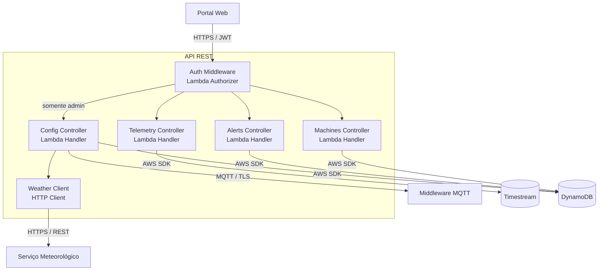
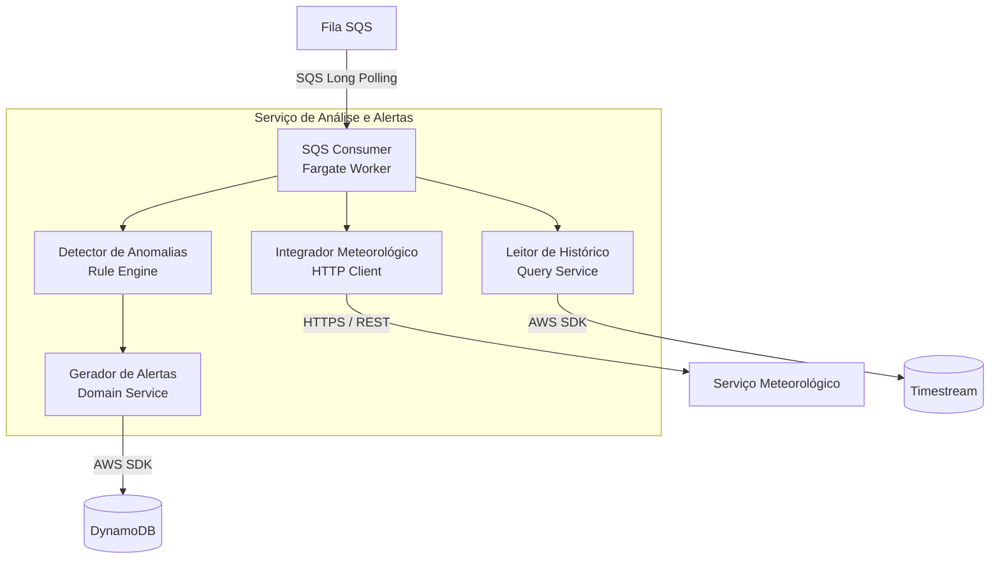

# 🔩 Nível 3 — Diagrama de Componentes

**"O que há dentro de cada container?"**

[← C2: Containers](./c2-containers.md) · **C3: Componentes** · [C4: Código →](./c4-code.md)

---

## 🎯 O que este nível mostra

Entramos dentro de dois containers críticos e revelamos seus **componentes internos** — as classes, módulos e serviços que os compõem. Este é o nível mais próximo do que os desenvolvedores vão implementar.

São detalhados aqui:

- 🔌 **API REST** — a porta de entrada do sistema, responsável por autenticação, roteamento e orquestração das operações do portal
- 🧠 **Serviço de Análise e Alertas** — o cérebro do sistema, que detecta anomalias na telemetria e gera alertas inteligentes

---

## 3.1 — API REST

> O portal web não conversa com bancos de dados diretamente — tudo passa pela API. Aqui detalhamos como ela está organizada internamente: um authorizer centralizado que guarda a porta, e quatro controllers especializados, cada um dono de um domínio.

### Catálogo de Componentes — API REST

| Componente | Tipo | Função |
|---|---|---|
| 🔐 **Auth Middleware** | Lambda Authorizer | Guarda de segurança. Nenhuma requisição chega aos controllers sem passar por aqui |
| 🚜 **Machines Controller** | Lambda Handler | Dono do domínio `Machine` — registro, status, localização e metadados da frota |
| 📡 **Telemetry Controller** | Lambda Handler | Expõe o histórico de sensores. Leitura pura — nunca escreve dados de telemetria |
| 🚨 **Alerts Controller** | Lambda Handler | Gerencia o ciclo de vida dos alertas: listagem, acknowledge e anotações |
| ⚙️ **Config Controller** | Lambda Handler | Único que escreve no MQTT. Valida clima antes de aplicar configuração no campo |
| 🌦️ **Weather Client** | Módulo HTTP | Abstrai o fornecedor de clima. Pode ser trocado sem impactar nenhum controller |

---

## 3.2 — Serviço de Análise e Alertas

> Este é o componente de maior valor do sistema. Enquanto a ingestão apenas salva dados, a análise os interpreta. O pipeline interno vai do consumo da fila até a geração de um alerta contextualizado com dados climáticos — tudo de forma assíncrona.

### Catálogo de Componentes — Serviço de Análise

| Componente | Tipo | Função |
|---|---|---|
| 🔄 **SQS Consumer** | Worker Loop | Orquestrador do pipeline. Coordena a ordem de execução dos demais componentes |
| 📚 **Leitor de Histórico** | Query Service | Busca contexto histórico da máquina para que a detecção não seja só por limiar fixo |
| 🔍 **Detector de Anomalias** | Rule Engine | Combina regras estáticas (limiares) com análise estatística (desvio padrão) |
| 🌦️ **Integrador Meteorológico** | HTTP Client | Reduz falsos positivos — uma máquina em 42°C num dia de 38°C não é anomalia |
| 🚨 **Gerador de Alertas** | Domain Service | Produz alertas ricos com recomendação de ação e evita duplicação de alertas abertos |

---

[← C2: Containers](./c2-containers.md) · **C3: Componentes** · [C4: Código →](./c4-code.md)

