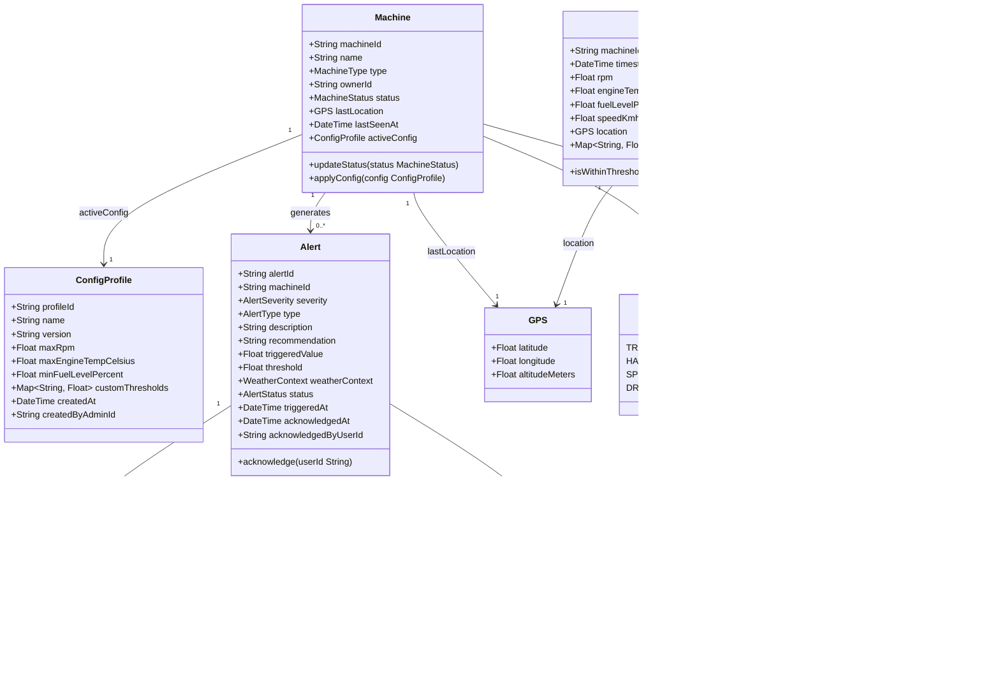
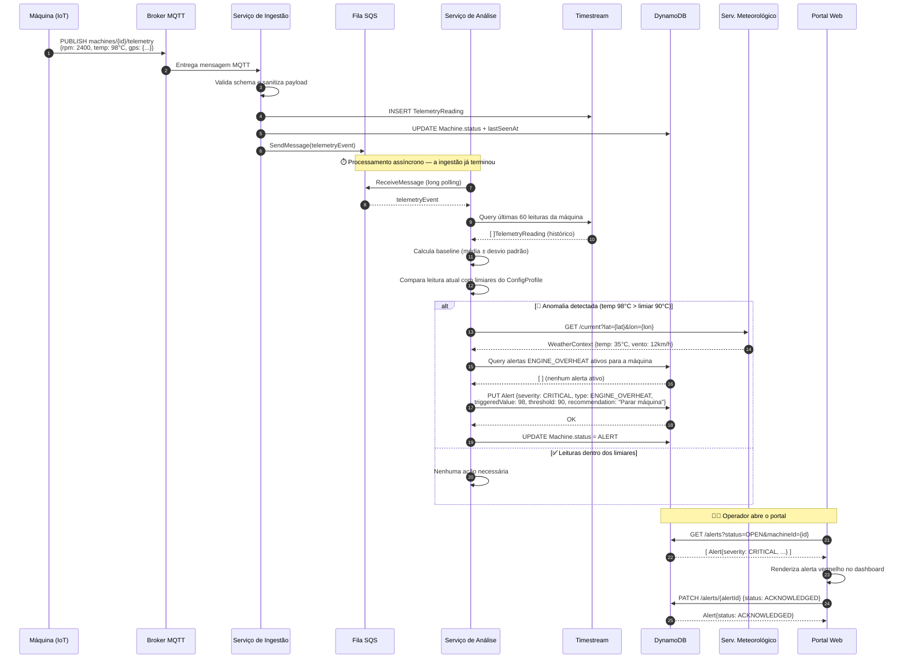

# 💻 Nível 4 — Código

**"Como as estruturas de dados e os fluxos críticos se comportam?"**

[← C3: Componentes](./c3-components.md) · **C4: Código** · [↑ README](../README.md)

---

## 🎯 O que este nível mostra

O nível de código é o mais granular do C4 Model. Aqui saímos dos boxes e setas e descemos ao nível de **classes, entidades e fluxos de execução**.

Dois artefatos documentam este nível:

1. **Modelo de Domínio** — as entidades centrais do sistema e seus relacionamentos. É a linguagem ubíqua: a mesma estrutura que vive no banco, na API e no frontend.

2. **Diagrama de Sequência** — o caminho crítico do sistema: um dado sai do sensor de uma máquina e percorre toda a stack até se tornar um alerta visível para o operador.

---

## 4.1 — Modelo de Domínio

> Cinco entidades principais estruturam o sistema. `Machine` é o ator central — ela tem um perfil de configuração ativo, gera leituras de telemetria e, quando algo sai dos limiares, produz alertas enriquecidos com contexto climático.

### Entidades principais

| Entidade | Armazenamento | Descrição |
|---|---|---|
| `Machine` | DynamoDB | Representa uma máquina da frota. Chave primária de quase tudo |
| `TelemetryReading` | Timestream | Uma leitura dos sensores num instante de tempo. Gerada continuamente |
| `ConfigProfile` | DynamoDB | Perfil de comportamento aplicado remotamente a uma máquina |
| `Alert` | DynamoDB | Anomalia detectada, com contexto climático e recomendação de ação |
| `WeatherContext` | Embedded no Alert | Snapshot das condições climáticas no momento do alerta |
| `User` | DynamoDB | Operador ou Administrador com acesso à plataforma |

---

## 4.2 — Fluxo de Telemetria (Caminho Crítico)

> Do sensor ao alerta: um trator com motor superaquecendo publica uma leitura de 98°C. Este diagrama mostra cada passo que o sistema dá até o operador ver o alerta vermelho no dashboard.

### Fases do fluxo

| Fase | Participantes | O que acontece |
|---|---|---|
| **1. Publicação** | Máquina → Broker | Dado bruto do sensor sai do campo via MQTT/TLS |
| **2. Ingestão** | Broker → Lambda → SQS | Valida, persiste no Timestream e enfileira para análise. Rápido e stateless |
| **3. Análise** | SQS → Fargate | Consome assincronamente, calcula baseline, detecta anomalia com contexto climático |
| **4. Alerta** | Fargate → DynamoDB | Persiste alerta enriquecido somente se não há alerta ativo do mesmo tipo |
| **5. Visualização** | Portal → DynamoDB | Operador consulta alertas abertos e faz acknowledge |

---

[← C3: Componentes](./c3-components.md) · **C4: Código** · [↑ README](../README.md)

